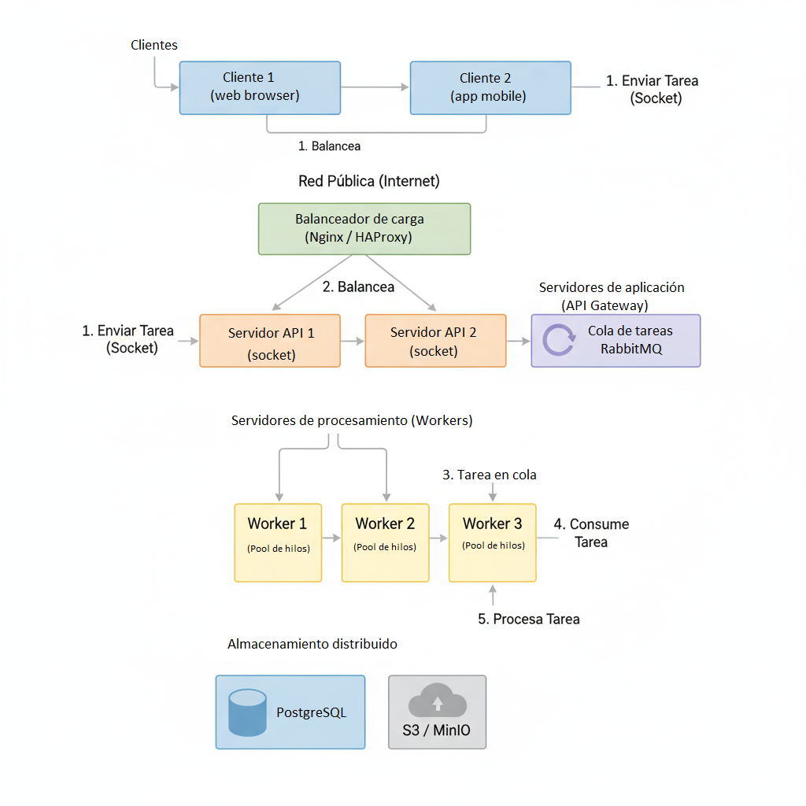
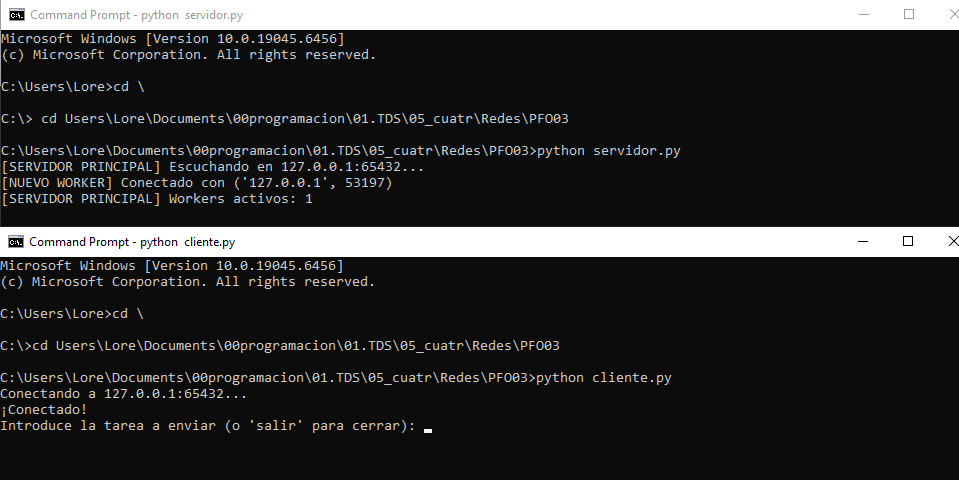
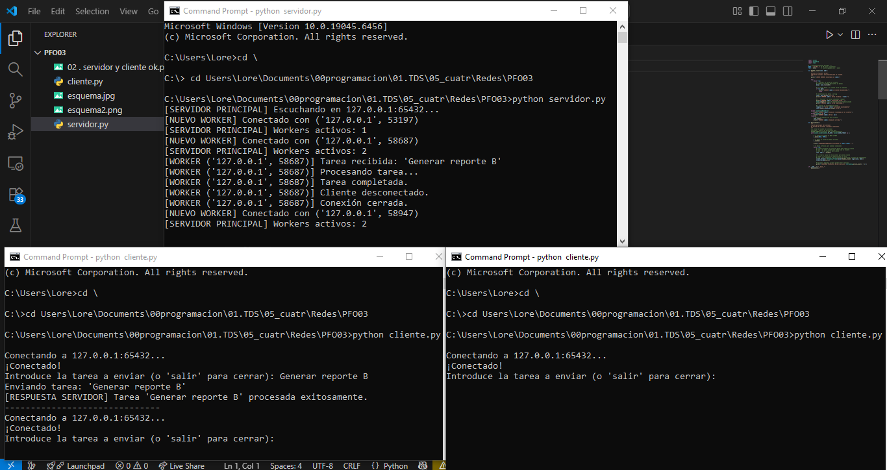
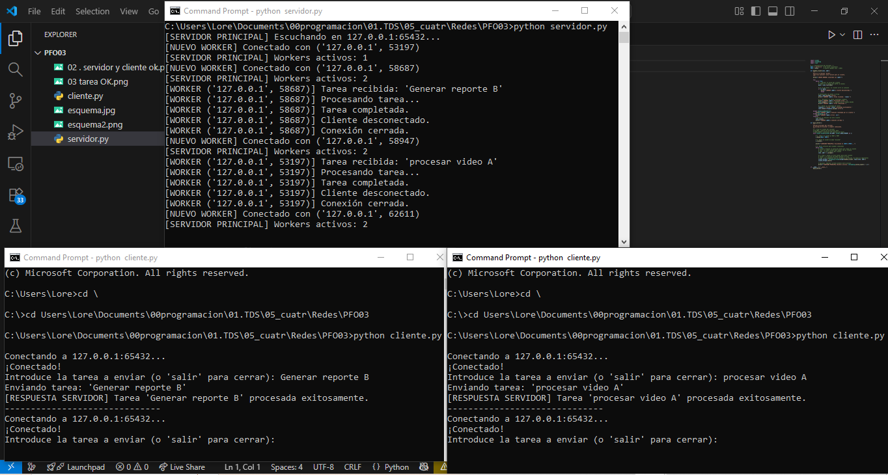
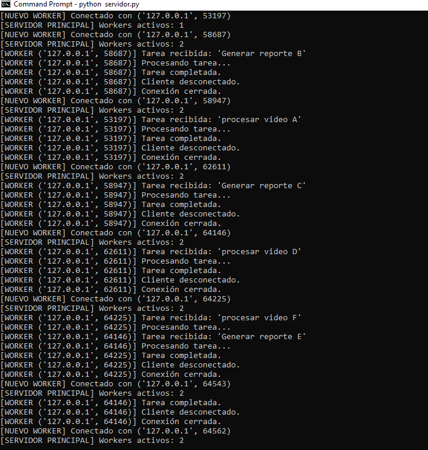

# PFO 3: Rediseño como Sistema Distribuido (Cliente-Servidor)
## Alejandra Lorena Rachich - Programación sobre redes - Com. 3E

Este proyecto corresponde a la Práctica Formativa Obligatoria 3, donde el objetivo es transformar un sistema monolítico en una arquitectura distribuida básica, implementando el modelo cliente-servidor mediante sockets y concurrencia.

---

<details>
<summary><strong>Ver Consigna del Trabajo Práctico</strong> (click para expandir)</summary>

> ### PFO 3: Rediseño como Sistema Distribuido (Cliente-Servidor)
> 
> **Objetivo:** Transformar el sistema en una arquitectura distribuida usando sockets.
> 
> **Consignas:**
> 1. Diseñar un diagrama que incluya:
>    * Clientes (móviles, web).
>    * Balanceador de carga (Nginx/HAProxy).
>    * Servidores workers (cada uno con su pool de hilos).
>    * Cola de mensajes (RabbitMQ) para comunicación entre servidores.
>    * Almacenamiento distribuido (PostgreSQL, S3).
> 2. Implementar en Python:
>    * Un servidor que reciba tareas por socket y las distribuya a workers.
>    * Un cliente que envíe tareas y reciba resultados.
> 
> **Entregables:**
> * Diagrama del sistema.
> * Código del servidor y cliente en repositorio de Github

</details>

---


## 1. Diagrama de la Arquitectura

Se diseñó un diagrama de arquitectura distribuida que incluye los siguientes componentes, según lo solicitado en la consigna:

* **Clientes:** (Móvil, Web)
* **Balanceador de Carga:** (Nginx)
* **Servidores de Aplicación/API:** (Workers con pool de hilos)
* **Sistema de Colas:** (RabbitMQ)
* **Almacenamiento Distribuido:** (PostgreSQL y S3)



---

## 2. Implementación en Python (Sockets)

La implementación se centra en la comunicación directa entre clientes y un servidor concurrente usando sockets TCP.

### Archivos

* `servidor.py`: Un servidor TCP concurrente. Utiliza el módulo `threading` para crear un "pool de hilos", asignando un hilo "worker" a cada cliente que se conecta. Esto permite al servidor manejar múltiples clientes de forma simultánea sin bloquearse.

* `cliente.py`: Un cliente TCP que se conecta al servidor. Permite al usuario introducir una "tarea" (un string) que se envía al servidor. Luego, el cliente espera la respuesta de confirmación del servidor.

### Cómo ejecutar el proyecto

Se necesitan al menos dos terminales (idealmente tres para probar la concurrencia).

**1. Iniciar el Servidor**

En una terminal se ejecuta el servidor, que quedará escuchando conexiones en `127.0.0.1:65432`.

```bash
python servidor.py
```


**2. Iniciar Clientes**

En una o más terminales nuevas, se ejecuta el script del cliente.

```bash
python cliente.py

```



**3. Ejecutar tareas**

El script pedirá que se introduzca una tarea.

Escribir la tarea y presionar Enter.


El cliente enviará la tarea al servidor y esperará la respuesta.

Se pueden ejecutar múltiples instancias del cliente al mismo tiempo para demostrar cómo el servidor las maneja en hilos separados.


### Vistas del servidor y clientes




